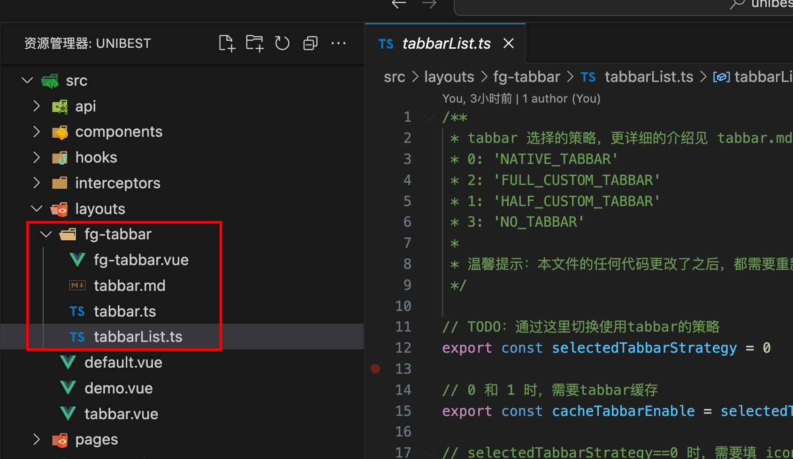
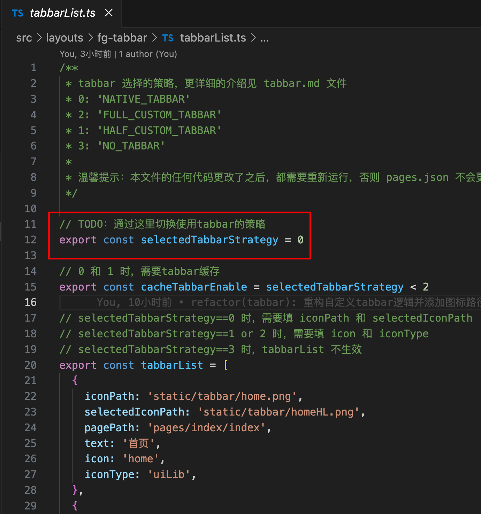

# tabbar 专题

> 2025-06-21 开始，新的 `base` 模板同时支持旧的 `tabbar` 和 `spa` 模板，这里大致介绍一下使用。(`tabbar` 和 `spa` 模板已经不再需要了。)

`tabbar` 分为 `4 种` 情况：

- `完全原生 tabbar`，使用 `switchTab` 切换 tabbar，`tabbar` 页面有缓存。
  - 优势：原生自带的 tabbar，最先渲染，有缓存。
  - 劣势：只能使用 2 组图片来切换选中和非选中状态，修改颜色只能重新换图片（或者用 iconfont）。
- `半自定义 tabbar`，使用 `switchTab` 切换 tabbar，`tabbar` 页面有缓存。使用了第三方 UI 库的 `tabbar` 组件，并隐藏了原生 `tabbar` 的显示。
  - 优势：可以随意配置自己想要的 `svg icon`，切换字体颜色方便。有缓存。可以实现各种花里胡哨的动效等。
  - 劣势：首次点击 tababr 会闪烁。
- `全自定义 tabbar`，使用 `navigateTo` 切换 `tabbar`，`tabbar` 页面无缓存。使用了第三方 UI 库的 `tabbar` 组件。
  - 优势：可以随意配置自己想要的 svg icon，切换字体颜色方便。可以实现各种花里胡哨的动效等。
  - 劣势：首次点击 `tababr` 会闪烁，无缓存。
- `无 tabbar`，只有一个页面入口，底部无 `tabbar` 显示；常用语临时活动页。

上述文档在代码中也有一份，方便开发者查阅。`./src/layouts/fg-tabbar/tabbar.md`

> 注意：花里胡哨的效果需要自己实现，本模版不提供。

总览如下，文件路径为 `./src/layouts/fg-tabbar/tabbarList.js`。首先选择使用哪个 `策略`，然后配置对应的 `tabbarList`。




关键代码如下：

```ts
/**
 * tabbar 选择的策略，更详细的介绍见 tabbar.md 文件
 * 0: 'NATIVE_TABBAR'  `完全原生 tabbar`
 * 2: 'FULL_CUSTOM_TABBAR' `全自定义 tabbar`
 * 1: 'HALF_CUSTOM_TABBAR' `半自定义 tabbar`
 * 3: 'NO_TABBAR' `无 tabbar`
 *
 * 温馨提示：本文件的任何代码更改了之后，都需要重新运行，否则 pages.json 不会更新导致错误
 */

// TODO：通过这里切换使用tabbar的策略
export const selectedTabbarStrategy = 0;

// selectedTabbarStrategy==0 时，需要填 iconPath 和 selectedIconPath
// selectedTabbarStrategy==1 or 2 时，需要填 icon 和 iconType
// selectedTabbarStrategy==3 时，tabbarList 不生效
export const tabbarList = [
  {
    iconPath: 'static/tabbar/home.png',
    selectedIconPath: 'static/tabbar/homeHL.png',
    pagePath: 'pages/index/index',
    text: '首页',
    icon: 'home',
    iconType: 'uiLib',
  },
  // ...
];
```

`tabbar` 相关配置统一配置在上面这个文件，`pages.config.ts` 已经默认引入。 ^\_^

> 2025-06-21 周六，肝了一整天，留个纪念。
